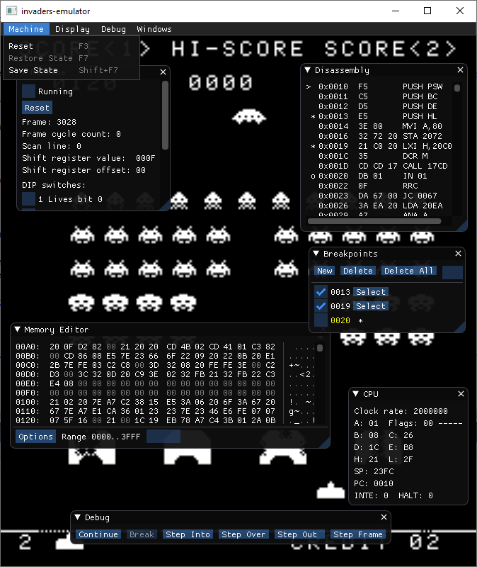

invaders-emulator
=====

## About

Cross-platform Space Invaders emulator. My first emulator! Inspired by the excellent tutorial at [Emulator 101](http://emulator101.com).

 

## Dependencies

This project depends on [SDL2](https://www.libsdl.org) (at least version 2.0.6) and [SDL_mixer 2.0](https://www.libsdl.org/projects/SDL_mixer/)

Unzipped invaders ROMs should be placed the 'data' folder. The emulator will not run if the ROMs are not present.

Unzip samples 0.wav .. 8.wav from http://samples.mameworld.info/ into the 'data' folder. The emulator can run without samples present.

## Windows

The [SDL2 Development libraries for Visual C++](https://www.libsdl.org/download-2.0.php) are checked in to 3rdparty for convenience. 

## Linux

Install using your package manager, e.g.

	$ sudo apt-get install libsdl2-dev
	$ sudo apt-get install libsdl2-mixer-dev
	
or [download](https://www.libsdl.org/download-2.0.php) and install from source

## Building

This project uses [GENie](https://github.com/bkaradzic/genie) to generate the build files for the target platform.

### Windows

Run genie_vs2017.bat or genie_vs2019.bat to build the Visual Studio Solution and projects into the 'build' folder

### Linux

	$ git clone https://github.com/howprice/invaders-emulator
	$ cd invaders-emulator
	$ tools/bin/linux/genie gmake  (OR ./genie_gmake.sh) 
	$ cd build
	$ make

n.b. You may need to 'chmod +x' genie executable - I haven't figured out how to make the checked in file executable.

`make` with no config specified defaults to the debug config for native architecture (usually 64-bit). Can call `make config=<xxx>` where `xxx` can be `debug`, `dev`, `release`, `debug32`, `dev32`, `release32`, `debug64`, `dev64` or `release64`. Or type `make help` for more info. Make sure you're in the `build` folder.

### Other Platforms

Not yet tested. May require minor fix-up for Raspberry Pi and OSX

## Running

### Linux

	$ cd data
	$ ../bin/debug/emulator

## Controls

### Game Controls
- Press 5 to insert coin
- Press 1 to start one player game
- Press 2 to start two player game
- Player 1 controls: Controller or keyboard cursors left/right and space
- Player 2 controls: Share Player 1 controls, or second controller and O, P, and Q keys
- Press Esc to quit
- Press T to tilt

### Emulator Controls
- Tab - Toggle user interface.
- F3 - Reset machine
- F5 - Break / resume execution
- Shift+F7 - Save state (to memory)
- F7 - Restore state (from memory)
- F8 - Step Frame
- F10 - Step Over
- F11 - Step Into
- Shift+F11 - Step Out

- Right click on Disassembly Window for context menu

## Notes

Cycle-exact emulation is not required.

## Links and thanks

- [Emulator 101](http://emulator101.com)
- The excellent [ImGui](https://github.com/ocornut/imgui)
- http://www.emutalk.net/threads/38177-Space-Invaders
- https://en.wikipedia.org/wiki/Intel_8080
- Intel 8080 Assembly Language Programming Manual a.k.a. "The Data Book"
- [Intel 8080/8085 Assembly Language Programming](https://www.tramm.li/i8080/Intel%208080-8085%20Assembly%20Language%20Programming%201977%20Intel.pdf)
- [Intel 8080 Microcomputer System User's Manual](http://www.nj7p.info/Manuals/PDFs/Intel/9800153B.pdf)
- [Computer Archeology - Space Invaders](http://computerarcheology.com/Arcade/SpaceInvaders/)
  - [Disassembled Code as Z80 opcodes](http://computerarcheology.com/Arcade/SpaceInvaders/Code.html)
  - [RAM Usage](http://computerarcheology.com/Arcade/SpaceInvaders/RAMUse.html)
  - [Hardware](http://computerarcheology.com/Arcade/SpaceInvaders/Hardware.html)

## TODO

- Factor Renderer out of Display
- Main menu Display -> Zoom -> 1x/2x/3x/4x option
- Main menu Display -> Vsync option (disabled if not available)
- Option to disable VSYNC. Manual (high performance) frame timing instead. Required for Raspberry Pi
- Update README.md to cover Mac OS X and Raspberry Pi
- Figure out SDL2 Mac High DPI. See SDL_CreateWindow docs. Requires Info.plist?
- Deploy with travis?
- Apply coloured overlay (make machine display buffer RGB8 and apply in video RAM copy)
- Watchpoints (break when memory read/written to)
- Move debugHook into debugger class/file
- Get rid of Machine.memorySizeBytes: memory could have gaps, and may not be a contiguous block
- Update memory window to select Chunk to view, which is guaranteed to be a single contiguous block.
- "Backtrace" Window (Previously executed line(s))
- Stack Window
  - Store "stack base" when SP set with LXI SP,<address> instruction
- Editable registers in CPU Window
- Trap?
- Disassembly Window:
  - Use ImGuiListClipper (see ImGui hex editor code)
  - Add Autoscroll option
- Support loading of symbols file
    - Ref: pasmo docs
	- Ref: Computer Archaeology annotated disassembly
- Load different Midway 8080 Black & White compatible ROMs
  - List in mame\src\mame\drivers\mw8080bw.cpp
- Cheats
  - How does MAME handle cheats?
- Accurate display buffer generation by copying pixel by pixel as the CPU / raster progresses. 
- What is the correct point in the frame to generate the interrupts? See machine update function
- Headless mode (command line arg)
- What is the purpose of the RAM mirror? (It *is* used)

